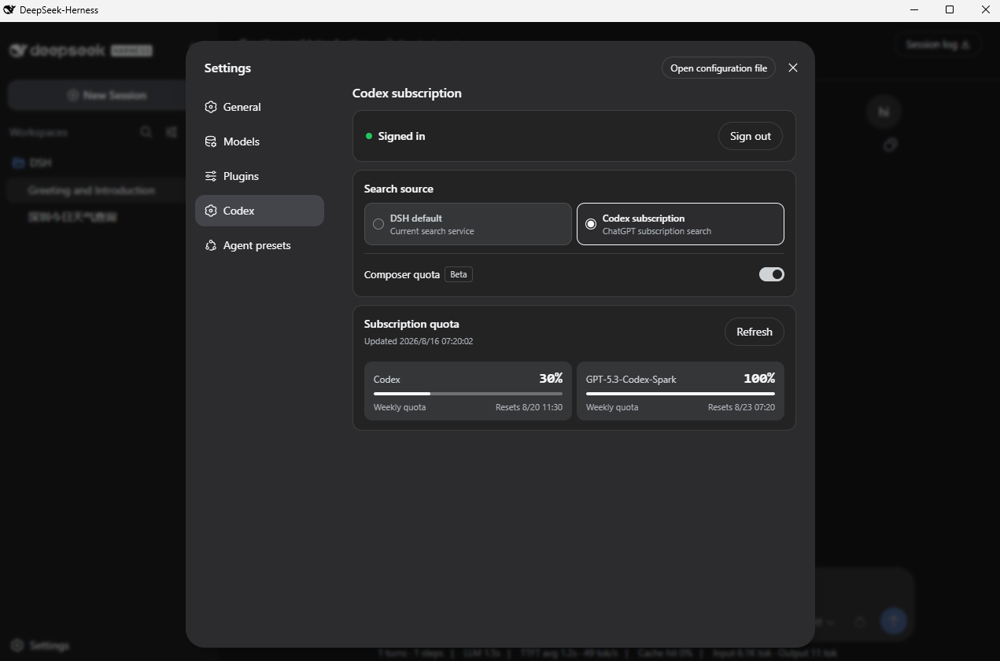
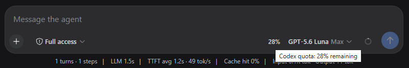

# DSH Codex Subscription

[](https://github.com/WSL043/dsh-codex-subscription/actions/workflows/ci.yml)
[](https://www.npmjs.com/package/dsh-codex-subscription)
[](LICENSE)
[](https://github.com/WSL043/dsh-codex-subscription/stargazers)

[简体中文](README.md)

Sign in to ChatGPT and use a Codex subscription directly in DeepSeek Harness.
No OpenAI API key or Codex CLI installation is required. DSH conversations,
tools, permissions, image generation, search choice, and quota stay in one place.

[Agent install](#let-an-agent-install-it-recommended) · [Windows install](#manual-windows-install) · [Update or uninstall](#update-and-uninstall)



Settings shows sign-in, search source, and the separate standard Codex and Spark
quota returned by the service.

If this helps, open the [GitHub repository](https://github.com/WSL043/dsh-codex-subscription) and click **Star** in the upper-right corner so more DSH users can find it.

## What it does

- Uses your ChatGPT / Codex subscription directly inside DSH, with no OpenAI API key or Codex CLI required;
- Signs in to ChatGPT from Settings and keeps credentials on the host;
- Supports Codex image generation and shows the result directly in the DSH conversation;
- Switches between DSH's default search and Codex subscription search;
- Shows the quota, reset time, and freshness actually returned by the backend;
- Can show the selected Codex model's remaining quota before the model name (Beta, off by default);
- Keeps Codex-Spark, Credits, and other independent limits separate;
- Fails visibly when subscription routing is unavailable instead of silently using another paid route.

## Prepare DSH

This plugin supports DeepSeek Harness `0.1.0-rc.6` and requires a ChatGPT account
that currently has Codex access.

- Do not want to configure Node.js? Use the [community DSH-Portable package](https://github.com/WSL043/DSH-Portable).
- Prefer the official route? Follow the [DeepSeek Harness run guide](https://github.com/deepseek-ai/deepseek-harness#run).

If DSH already opens normally, continue with the plugin installation below.

## Install

### Let an Agent install it (recommended)

Send the following URL directly to your Agent. The guide contains install,
update, uninstall, and verification steps. It preserves the DSH profile and
sign-in and never restarts DSH without permission:

[Open the Agent installation guide](https://raw.githubusercontent.com/WSL043/dsh-codex-subscription/main/AGENTS.md)

```text
https://raw.githubusercontent.com/WSL043/dsh-codex-subscription/main/AGENTS.md
```

### Manual Windows install

Open PowerShell and paste these two lines in order. They support both a normal DSH install
and DSH-Portable. Portable users do not need a system Node.js or pnpm.

```powershell
curl.exe -fL https://github.com/WSL043/dsh-codex-subscription/releases/latest/download/dsh-codex.ps1 -o "$env:TEMP\dsh-codex.ps1"
powershell.exe -NoProfile -ExecutionPolicy Bypass -File "$env:TEMP\dsh-codex.ps1" Install
```

`Bypass` applies only to this child process and does not change the system
PowerShell execution policy.

The commands support both a normal DSH installation and DSH-Portable. Portable
users do not need a separate Node.js or pnpm installation, and no administrator
access is required. The installer finds DSH, verifies the result, and adds the
per-user `dsh-codex` command. It does not change the system execution policy or
restart DSH on its own.

If the portable folder was renamed or moved, start the intended DSH-Portable copy
once and install again. Restart DSH manually after installation.

<details>
<summary>macOS, Linux, or an existing <code>dsh</code> command</summary>

```sh
dsh plugin --profile web add dsh-codex-subscription
dsh plugin --profile web list dsh-codex-subscription --depth 0
dsh --profile web --dump-config
```

The plugin list should contain one `dsh-codex-subscription`, and the config should
contain one `codex-subscription` entry.

</details>

## Sign in and use

1. Open **Settings -> Codex** in DSH.
2. Sign in with a ChatGPT account that has Codex access.
3. Choose DSH default search or Codex subscription search.
4. Choose a Codex model from the model selector.

Describe the image you want. The Agent can generate it through Codex and show the result in the conversation.

Codex subscription search reuses the same ChatGPT sign-in and does not need an
OpenAI API key. Changing the search source does not change the conversation
model, and a failed source never silently falls back to another paid service.
Existing DSH search remains the default after an upgrade; opt in to Codex
subscription search when wanted.

## How quota is shown



- Settings always shows the detailed quota returned by the backend. The compact percentage is Beta and off by default;
- When enabled, it appears inside the composer before the model name and only while a Codex model is selected;
- Standard Codex models use the lowest remaining standard Codex window, avoiding an overly optimistic number;
- A selected Spark model uses the separate Spark quota returned by the backend;
- Only windows actually returned by the backend are shown; there is no hard-coded “5-hour + weekly” layout;
- If the account currently reports only weekly usage, no 5-hour window is invented; it appears automatically if the backend restores it;
- Independent Codex-Spark limits are not merged into standard Codex quota;
- Credits and monthly spending caps appear only when the account or workspace actually returns them;
- Percentages describe usage status, not billing amounts or billing guarantees.

## Update and uninstall

Windows installer users only need these short commands:

| Action | PowerShell command |
| --- | --- |
| Update | `dsh-codex update` |
| Uninstall | `dsh-codex uninstall` |

Update verifies the latest Release manager script with SHA-256. Uninstall removes
the plugin and `dsh-codex` command while preserving the DSH profile, unrelated
plugins, and saved sign-in. If an older installation has no short command, run
the two Windows first-install commands above once.

<details>
<summary>Update or uninstall with an existing <code>dsh</code> command</summary>

Update and verify:

```sh
dsh plugin --profile web update dsh-codex-subscription
dsh plugin --profile web list dsh-codex-subscription --depth 0
dsh --profile web --dump-config
```

Uninstall:

```sh
dsh plugin --profile web remove dsh-codex-subscription
```

When updating manually from v0.2.1, remove the old package name only after the new
package installs successfully:

```sh
dsh plugin --profile web remove @wsl043/dsh-codex-subscription
```

</details>

If DSH is running, restart it manually after installation or update.

## Troubleshooting

- If `dsh-codex` is not found after installation, close and reopen PowerShell;
- If DSH-Portable is not found, start the intended portable copy once and retry;
- If `curl.exe` is missing, more than one DSH is present, or the command still
  fails, send the Agent guide URL above to an Agent. Do not change the machine
  PATH or execution policy, and do not delete a profile to force an install.

## Boundaries and support

- This package connects a ChatGPT subscription; it does not create an OpenAI API key;
- The ChatGPT Codex backend and DeepSeek Harness can change independently;
- This is a community project with no affiliation or endorsement from DeepSeek or OpenAI.

Use [GitHub Issues](https://github.com/WSL043/dsh-codex-subscription/issues) for
project feedback. For general DSH plugin discussion, visit
[DeepSeek Harness Discussions](https://github.com/deepseek-ai/deepseek-harness/discussions).
Read [SECURITY.md](SECURITY.md) before reporting sensitive issues.

[MIT](LICENSE)
