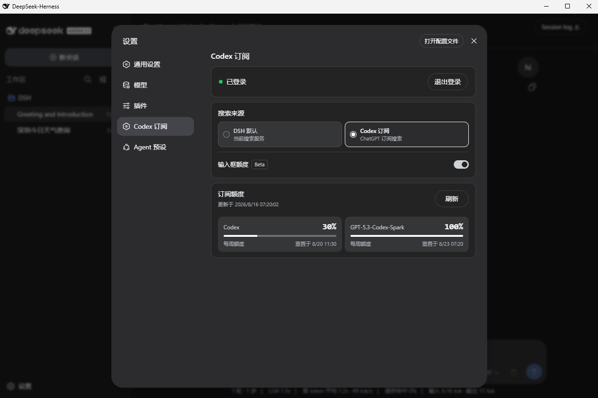

# DSH Codex Subscription

[](https://github.com/WSL043/dsh-codex-subscription/actions/workflows/ci.yml)
[](https://www.npmjs.com/package/dsh-codex-subscription)
[](LICENSE)
[](https://github.com/WSL043/dsh-codex-subscription/stargazers)

[English](README.en.md)

在 DeepSeek Harness 中直接登录 ChatGPT 并使用 Codex 订阅，不需要 OpenAI API Key，
也不依赖 Codex CLI。保留 DSH 原有的会话、工具和权限，还能生成图片、切换联网搜索来源并查看额度。

[交给 Agent 安装](#交给-agent推荐) · [Windows 手动安装](#windows-手动安装) · [更新与卸载](#更新与卸载)



设置页会显示登录状态、搜索来源，以及服务端实际返回的普通 Codex 与 Spark 独立额度。

如果它帮到了你，欢迎在 [GitHub 仓库](https://github.com/WSL043/dsh-codex-subscription)的右上角点一下 **Star**，也方便其他 DSH 用户发现。

## 能做什么

- 在 DSH 中直接使用 ChatGPT / Codex 订阅，不需要 OpenAI API Key 或 Codex CLI；
- 在设置页登录 ChatGPT，凭据保留在本机；
- 支持 Codex 图片生成，结果直接显示在 DSH 会话中；
- 可在 DSH 默认搜索与 Codex 订阅搜索之间切换；
- 展示服务端实际返回的额度、重置时间和更新时间；
- 可在模型名称左侧显示当前 Codex 模型的剩余额度（Beta，默认关闭）；
- 单独显示 Codex-Spark、Credits 等独立额度，不把它们混在一起；
- 订阅路由不可用时明确报错，不会静默切换到其他付费路由。

## 准备 DSH

本插件适配 DeepSeek Harness `0.1.0-rc.6`，还需要一个当前具有 Codex 使用资格的
ChatGPT 账户。

- 不想配置 Node.js：使用 [DSH-Portable（社区便携包）](https://github.com/WSL043/DSH-Portable)；
- 想按官方方式运行：查看 [DeepSeek Harness 官方说明](https://github.com/deepseek-ai/deepseek-harness#run)。

已经能正常打开 DSH 的用户可以直接继续安装插件。

## 安装

### 交给 Agent（推荐）

把下面的链接直接发给 Agent。文档包含安装、更新、卸载和验收步骤；Agent 不应删除
DSH profile、登录信息或擅自重启 DSH。

[打开 Agent 安装文档](https://raw.githubusercontent.com/WSL043/dsh-codex-subscription/main/AGENTS.md)

```text
https://raw.githubusercontent.com/WSL043/dsh-codex-subscription/main/AGENTS.md
```

### Windows 手动安装

打开 PowerShell，依次粘贴下面两行：

```powershell
curl.exe -fL https://github.com/WSL043/dsh-codex-subscription/releases/latest/download/dsh-codex.ps1 -o "$env:TEMP\dsh-codex.ps1"
powershell.exe -NoProfile -ExecutionPolicy Bypass -File "$env:TEMP\dsh-codex.ps1" Install
```

普通安装版和 DSH-Portable 都能使用。便携版不需要另装 Node.js 或 pnpm，整个过程不需要
管理员权限。安装器会自动寻找 DSH、验证安装结果，并添加当前用户的 `dsh-codex` 命令；
它不会修改系统执行策略或擅自重启 DSH。

如果便携文件夹改过名字或位置，先启动一次正确的 DSH-Portable，再执行安装。完成后手动
重启 DSH，让插件生效。

<details>
<summary>macOS、Linux，或已有 <code>dsh</code> 命令</summary>

```sh
dsh plugin --profile web add dsh-codex-subscription
dsh plugin --profile web list dsh-codex-subscription --depth 0
dsh --profile web --dump-config
```

安装列表中应只有一个 `dsh-codex-subscription`，配置中应只有一个
`codex-subscription` 条目。

</details>

## 登录与使用

1. 打开 DSH 的 **设置 -> Codex 订阅**；
2. 登录具有 Codex 使用资格的 ChatGPT 账户；
3. 选择使用 DSH 默认搜索，或使用 Codex 订阅搜索；
4. 在模型选择器中选择 Codex 模型。

需要图片时直接描述想要的画面，Agent 会调用 Codex 图片生成并在会话中显示结果。

Codex 订阅搜索复用同一份 ChatGPT 登录，不需要 OpenAI API Key。切换搜索来源不会改变
当前对话模型，也不会在失败时自动改走另一个付费服务。升级后默认保留 DSH 原有搜索，
需要使用 Codex 订阅搜索时再主动切换。

## 额度如何显示


- 设置页始终展示服务端返回的详细额度；快捷百分比是 Beta 功能，默认关闭；
- 开启后，百分比会显示在输入框内、模型名称左侧，只在选择 Codex 模型时出现；
- 普通 Codex 模型取标准 Codex 窗口中剩余最少的一项，避免给出过于乐观的数字；
- 选择 Spark 模型时，快捷百分比使用服务端返回的 Spark 独立额度；
- 只显示服务端实际返回的窗口，不写死“5 小时 + 每周”；
- 当前只有每周额度时不虚构 5 小时窗口，以后服务端恢复时会自动显示；
- Codex-Spark 等独立额度不会与普通 Codex 额度合并；
- Credits 和月度消费上限仅在账户或工作区真实返回时显示；
- 百分比表示使用状态，不是账单金额或计费承诺。

## 更新与卸载

Windows 安装器用户只需要两条短命令：

| 操作 | PowerShell 命令 |
| --- | --- |
| 更新 | `dsh-codex update` |
| 卸载 | `dsh-codex uninstall` |

更新会校验最新 Release 管理脚本的 SHA-256。卸载会移除插件和 `dsh-codex` 命令，但保留
DSH profile、其他插件和已保存的登录信息。旧版本如果还没有短命令，重新执行一次上面的
Windows 首次安装命令即可。

<details>
<summary>使用现有 <code>dsh</code> 命令更新或卸载</summary>

更新并检查：

```sh
dsh plugin --profile web update dsh-codex-subscription
dsh plugin --profile web list dsh-codex-subscription --depth 0
dsh --profile web --dump-config
```

卸载：

```sh
dsh plugin --profile web remove dsh-codex-subscription
```

从 v0.2.1 手动更新时，确认新包安装成功后再移除旧包名：

```sh
dsh plugin --profile web remove @wsl043/dsh-codex-subscription
```

</details>

如果 DSH 正在运行，安装或更新后请手动重启。

## 常见问题

- 找不到 `dsh-codex`：关闭并重新打开 PowerShell；
- 找不到 DSH-Portable：先启动一次正确的便携版，再重新安装；
- 没有 `curl.exe`、检测到多个 DSH，或仍然失败：把 Agent 文档链接发给 Agent，
  不要自行修改系统 PATH、执行策略或删除 profile。

## 边界与支持

- 本项目接入 ChatGPT 订阅，不会把订阅转换成 OpenAI API Key；
- ChatGPT Codex 后端和 DeepSeek Harness 都可能变化，兼容性以当前发布说明为准；
- 本项目为社区项目，与 DeepSeek、OpenAI 无隶属或背书关系。

本项目的问题反馈请使用 [GitHub Issues](https://github.com/WSL043/dsh-codex-subscription/issues)；
DSH 插件相关交流也可以前往
[DeepSeek Harness Discussions](https://github.com/deepseek-ai/deepseek-harness/discussions)。
敏感问题请先阅读 [SECURITY.md](SECURITY.md)。

[MIT](LICENSE)
